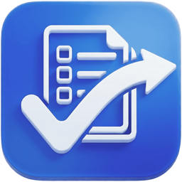
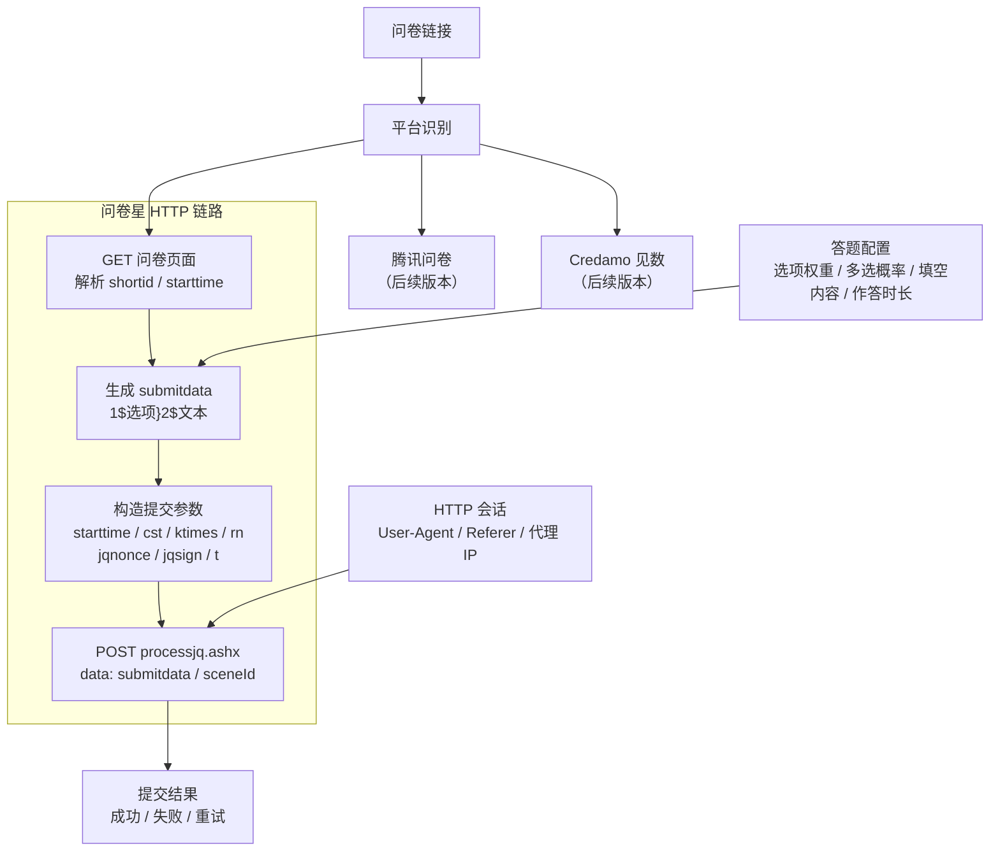

<div align="center">
  
  <h1>SurveyController Mac</h1>

  [](https://github.com/SurveyController/SurveyController-Mac/stargazers)
  [](https://github.com/SurveyController/SurveyController-Mac/releases/latest)
  
  [](https://github.com/SurveyController/SurveyController-Mac/issues)
  [](https://swift.org/)
  [](https://www.apple.com/macos/)
  [](./LICENSE)

  <p><strong>一站式问卷自动化处理程序 macOS 端，适配问卷星、腾讯问卷、Credamo见数平台</strong></p>
  <p>支持指定ip填写地区、信度系数、作答时长与分布比例</p>

</div>

> [!WARNING]
> **该项目仅供 HTTP 接口自动化学习与测试使用。** 请确保拥有目标测试问卷的授权再使用，**严禁污染他人问卷数据！**

---

## 主要特性

1. **原生 Mac 体验** - 纯 Swift + SwiftUI 构建，六步向导式流程，macOS 14+ 原生界面
2. **多平台支持** - v0.1 起支持问卷星全链路，腾讯问卷、Credamo见数后续版本跟进
3. **定制答案比例** - 自定义各选项权重与多选题命中概率分布，实时显示归一化比例
4. **指定ip地区** - 省市级地区选择，支持随机IP或指定特定地区IP提交
5. **配置导入导出** - 与 Windows 桌面版配置文件互通，跨设备同步
6. **运行体验** - 并发槽位、暂停/继续、完成系统通知、日志按次存档、防休眠

## 演示视频


## 开始使用

> [!TIP]
> **安装包：** 前往 [发行版](https://github.com/SurveyController/SurveyController-Mac/releases/latest) 下载最新版本压缩包，解压后拖入「应用程序」文件夹即可

**系统要求：** macOS 14（Sonoma）及以上

> [!NOTE]
> 首个版本未做 Developer ID 公证，首次打开请右键 →「打开」，或在「系统设置 → 隐私与安全性」中允许。

建议配合[教程文档](https://surveydoc.hungrym0.com/)食用。Windows 版请前往 [SurveyController](https://github.com/SurveyController/SurveyController)，安卓版请前往 [SurveyController-Android](https://github.com/shiaho777/SurveyController-Android)。

### 从源码构建

**环境要求：** Xcode 16+ / macOS 14+

```bash
git clone https://github.com/SurveyController/SurveyController-Mac.git
cd SurveyController-Mac
open SurveyController.xcodeproj   # Xcode 中 Cmd+R 运行

# 或命令行构建
xcodebuild -project SurveyController.xcodeproj -scheme SurveyController build

# 运行单元测试（86 个用例）
xcodebuild -project SurveyController.xcodeproj -scheme SurveyController test
```

## 使用方法

1. **输入问卷** - 在「任务」页粘贴问卷链接（剪贴板有链接时一键粘贴）
2. **自动解析** - 点击 `下一步`，自动识别平台和题目结构
3. **调整配置** - 在「答案」步对各题拖动滑块设置答案权重和概率分布
4. **设置运行参数** - 在「任务 / 网络」步指定目标份数、并发数、随机IP与地区等设置项
5. **检查并运行** - 预检通过后点击 `开始执行` 并等待任务完成

## 关键配置说明

| 配置项 | 说明 |
|--------|------|
| **目标份数** | 计划提交的问卷总数。建议先测试 3~5 份，确认配置没问题后再增加 |
| **并发数** | 同时提交的任务数量。并发越高速度越快，但失败率也可能更高 |
| **随机 IP** | 使用代理 IP 模拟不同地区访问。可指定省市地区，会消耗随机 IP 额度或自备代理资源 |
| **User-Agent** | HTTP 请求标识，决定问卷后台看到的访问设备来源 |
| **作答时长** | 高斯分布采样，控制问卷后台记录的作答耗时 |
| **提交间隔** | 同一并发的两次提交之间随机等待的秒数区间 |

详细配置项请参考[教程文档](https://surveydoc.hungrym0.com/runtime.html)。

## 技术架构



- **UI 层**：SwiftUI（NavigationSplitView 侧边导航 + 六步向导），对标官方 PySide6 Fluent 界面结构
- **引擎层**：Swift Concurrency（actor + TaskGroup），对标官方 asyncio 引擎
- **平台适配层**：Provider 协议 + 注册表，对标官方 providers/registry.py
- **依赖**：仅 SwiftSoup（HTML 解析），其余全部系统框架

## 交流群

如有疑问或需要技术支持，可加入QQ群：
346131215


## 参与贡献

欢迎提交 Pull Request，改进方向包括但不限于：
- 腾讯问卷 / Credamo见数 链路移植
- 信度系数、AI 填空、反填等官方功能对齐
- macOS 原生特性（菜单栏、快捷键、小组件）
- 性能优化与代码重构

## 贡献者

感谢以下贡献者对本项目的支持：

<div style="display: flex; gap: 10px;">
  <a href="https://github.com/shiaho777">
    
  </a>
  <a href="https://github.com/hungryM0">
    
  </a>
</div>

## 致谢

本项目基于 [SurveyController](https://github.com/SurveyController/SurveyController) macOS 端移植，感谢原项目团队的开源贡献。

## Star History

[](https://www.star-history.com/#SurveyController/SurveyController-Mac&type=date&legend=top-left)
